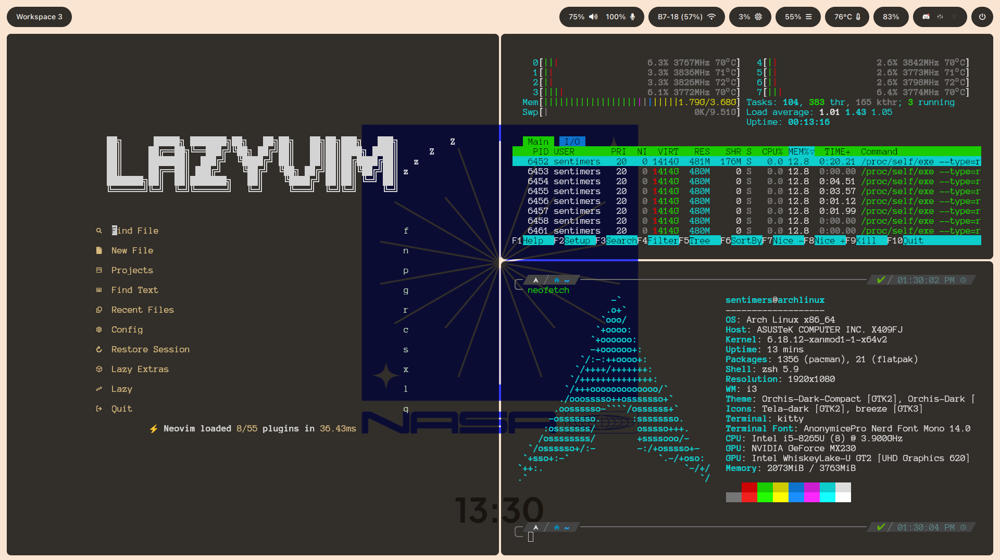
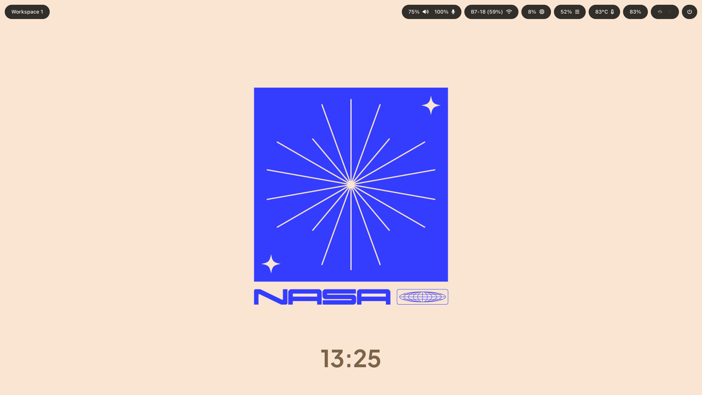

# Simple Dotfiles

A minimal i3 setup with an eww bar featuring audio, wifi, CPU, temperature, battery, and a floating clock widget. Nice for people who want setup their computer fast as possible

## Preview




---

## Dependencies

### Core

| Program  | Purpose                           |
| -------- | --------------------------------- |
| `i3`     | Window manager                    |
| `eww`    | Bar and clock widget              |
| `rofi`   | App launcher & power menu         |
| `picom`  | Compositor (transparency/shadows) |
| `kitty`  | Terminal                          |
| `thunar` | File manager                      |

### Audio & Network

| Program                    | Purpose                             |
| -------------------------- | ----------------------------------- |
| `pipewire` or `pulseaudio` | Audio backend                       |
| `pulseaudio-utils`         | Provides `pactl` for volume control |
| `networkmanager`           | Provides `nmcli` for wifi info      |

### Utilities

| Program       | Purpose                          |
| ------------- | -------------------------------- |
| `feh`         | Wallpaper setter                 |
| `i3lock`      | Screen locker                    |
| `xss-lock`    | Auto-lock before suspend         |
| `dex`         | XDG autostart support            |
| `xdo`         | Used to lower eww window layer   |
| `jq`          | JSON parsing in workspace script |
| `scrot`       | Screenshots                      |
| `clipmenu`    | Clipboard manager                |
| `vibrant-cli` | Display saturation control       |

### Fonts

| Font                    | Source                                                              |
| ----------------------- | ------------------------------------------------------------------- |
| SF Pro Text             | Apple (source manually)                                             |
| JetBrainsMono Nerd Font | [nerdfonts.com](https://www.nerdfonts.com)                          |
| Plus Jakarta Sans       | [Google Fonts](https://fonts.google.com/specimen/Plus+Jakarta+Sans) |

---

## Installation

### 1. Install packages (Arch Linux)

```bash
sudo pacman -S i3 rofi picom kitty nvim thunar feh i3lock xss-lock dex xdo jq scrot networkmanager dunst libnotify
```

```bash
# pulseaudio or pipewire (pick one)
sudo pacman -S pipewire pipewire-pulse
# or
sudo pacman -S pulseaudio pulseaudio-utils
```

```bash
# AUR packages (use yay or paru)
yay -S eww clipmenu vibrant-cli
```

### 2. Install fonts

```bash
# JetBrainsMono Nerd Font
yay -S ttf-jetbrains-mono-nerd

# Plus Jakarta Sans
yay -S ttf-plus-jakarta-sans

# SF Pro Text — download from Apple and install manually
yay -S apple-fonts
```

### 3. Clone and place config files

```bash
git clone https://github.com/SentimeterGG/simple-dotfiles.git
cd simple-dotfiles
cp * ~/
chmod +x ~/.config/*.sh
rm -rf README.md preview2.png preview1.png
```

### 4. Set your wallpaper path

Edit `~/.config/i3/config` and update this line to point to your wallpaper:

```
exec --no-startup-id feh --bg-fill ~/.wallpaper/nasa2.png
```

### 5. Start i3

Log out and select i3 from your display manager, or add `exec i3` to your `~/.xinitrc` and run `startx`.

---

## Keybindings

| Key                           | Action                   |
| ----------------------------- | ------------------------ |
| `Super + Enter` / `Super + T` | Open terminal (kitty)    |
| `Super + P`                   | App launcher (rofi)      |
| `Super + E`                   | File manager (thunar)    |
| `Super + V`                   | Clipboard menu           |
| `Super + Q`                   | Kill focused window      |
| `Super + F`                   | Fullscreen toggle        |
| `Super + W`                   | Toggle floating          |
| `Super + H/J/K/L`             | Focus left/down/up/right |
| `Super + Shift + H/J/K/L`     | Move window              |
| `Super + 1-0`                 | Switch workspace         |
| `Super + Shift + 1-0`         | Move window to workspace |
| `Super + Shift + S`           | Screenshot (area select) |
| `Super + R`                   | Resize mode              |
| `Super + Shift + C`           | Reload i3 config         |
| `Super + Shift + R`           | Restart i3               |
| `Super + Shift + Q`           | Exit i3                  |

---

## Notes

- The eww bar shows: workspace, audio volume, mic volume, wifi, CPU usage, temperature, battery, media controls, and a power button.
- The clock widget floats in the center of the screen and is sticky across all workspaces.
- `workspace.sh` subscribes to i3 events and updates the eww `WORKSPACE` variable in real time.
- On i3 reload, the workspace script is restarted with a 2 second sleep to avoid race conditions with the eww daemon.
